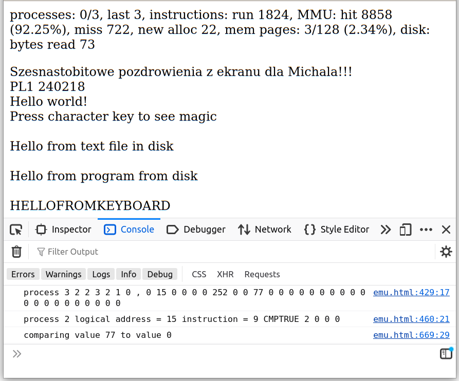

Version 240215

# Preamble

IT is full of smart ideas, unfortunatelly not all of them are used together in the most popular mainstream computer hardware (from different reasons).

If you look into free papers, you will see a lof of interesting concepts created by very intelligent people, for example:

* asynchronous design
* stack, RISC, CISC, VLIW, MIPS and accumulator architecture
* pipeline, superscalar, parallel processing
* branch and instruction prediction
* instruction reordering
* Harvard / Naumann architecture
* virtual memory with paging / 2-level paging / segmentation / paged segmentation / segmented paging
* dynamic address translation / base and bound translation
* TLB (Translation Lookaside Buffers)
* Naumann machine
* Hyperthreading

You can find description of X86, Risc-V, ARM, Z80, MP-4 and many others. Studying them is like tasting sweets in the big shop.

**Can something be done differently? Or better?**

I'm thinking for example about CPU, which will be setup to different instruction set on program start.

# This project

This research project has in target preparing free design of the **PL1** CPU / hardware, which (I hope)
in some moment will be ellegant and effective (maybe even more effective than some popular generic solutions).
It doesn't immediately reject elements abandomed by other designs, but rather look on profits and problems
related to them in concrete scenarios.

In other words: I want to take best from Risc-V and others and in next iterations
prepare some (possibly) more secure and simple ISA, which probably will be very close to the
real-time hardware/software solution.

During some research I have found project [Antikernel](https://github.com/azonenberg/antikernel)
and also after looking into it I have defined some first naive targets:

1. hardware (CPU) should make task switching as effective as possible - I don't want to
have saving / restoring registers every time (is it possible with reasonable cost? maybe
L1 cache should contain registers?), additionally I don't want to have scheduler in software,
if possible (main argument for software based solution is flexibility, ability of measuring CPU usage,
etc., but we have unnecessary instructions running)
2. CPU should not give too many ways for communicating processes - memory sharing is
enough and it will avoid unnecesary copying data and other things (in many documents you will find
it the most efficient)
3. (more generic version of previous) hardware should force writing software in optimized way.
Example: no polling, if possible, just registering for events.
4. CPU should cooperate on lowest level with DRAM, USB, etc. and fully disable them, when possible
5. no kernel/user/hypervisor mode = no kernel and possibility of capturing somebody's data
(which leads to question: how to protect again DoS and malicious behaviors?)

Note: although some of them don't look serious, researchers are thinking about them or even
propose related PoC (again: Antikernel)

# This is wasting time & opening opened doors

Maybe yes, maybe no. Mainstream hardware is changing and is better every day.
From the other hand, it will never be the best in everything...and special
projects have always place and/or niche.

Please look on such companies like Apple - in majority they're taking existing
solutions and merging them in new, unexpected way.

**Why shouldn't use the same pattern?**

Additionally: real man should have son, plant tree and build house.

Rhetorical question: is it possible to extend it and add building own CPU?

Some people are collecting cars, some looking for stamps and some want to
design CPU (note: it gives me much bigger fun that creating 
[386 Protected Mode kernel in 2005](https://mwiacek.com/zips/wat.pl/6/tm_cw_os.rar)). Point.

# This project is repeating design history from 16-bit to 32-bit and from console to graphical GUI design

Rome was not built in one day.

# License

Please have in mind, that author of this repo will be more than happy, if you could share
with him project(s) or device(s) using this ISA.

# First targets and timeline

This project was initially separated into general stages, in every please expect many iterations:

* Stage 1 - simulating things in software (HTML page, on the beginning very primitive,
later updated with memory protecting / MMU, virtual memory, etc.,
the most probably many iterations)
* Stage 2 - simulating things in software (rather Verilog & not VHDL,
maybe already with pipelines, multicore and asynchronous design)
* Stage 3 - creating real hardware

I don't have plans for replacing the most popular ISAs (there are milions of people behind them
and in the end the most important is not ISA, but software working on it). It is possible, that
stage number 3 will happen in far future... but if project goals will be achieved, maybe it will be
possible at least creating secure and effective embedded devices. Who knows?

(Update 18 Feb 2024) Example from work done in first project days:



(Update 25 Feb 2024) There is already very primitive software emulator and some postmortem document
describing, where it can go. Now I need to go into drawing board and make it much, much better.

# About author

Tester and (at least partially) developer. Software related engineer, who likes
low-level work with hardware. Good in optimalizing things.

# Contact
* GitHub and/or
* marcin ( at ) mwiacek (.) com + marcin.wiacek.work ( at ) gmail (.) com
(the best send your message to both)

# Why it was really started

Because of frustration, that hardware is much better than years ago, but... still doesn't break
some barriers.

In the market you can find many beautiful and incredible devices, for example
8cm x 8cm x 4,3cm big mini PC (Minisforum EM780), Mac mini, Macbook Air or powerfull
Ryzen 9 / Threadripper systems with 16 or more cores (forget about Intel in this moment)
or even 14" laptops with 73Wh battery and weight 1kg, we also hear about next revolution
waiting on the corner (Snapdragon X Elite).

There are visible few incredible ISAs (Instruction Architecture Sets) in
mainstream, unfortunately there are some important issues with them:

1. x86 - I was using many laptops (HP Elitebook, Dell Precision, Dell XPS, Hypebook
L14 11gen / Clevo L140MU, Lenovo, Acers, Asus and others), but:

    * they had annoying design decisions (for example with Dell Precision 5510 after
    longer inactivity period, discharging battery and connecting it to the charger
    internal keyboard doesn't work very well before Windows login, which suggests some
    power problem and decreasing speed of the internal keyboard controller)
    * in generall they were not able to achieve more than 10-15h in the normal work
    (Clevo L140MU is exception and [sometimes allows even for 36h](https://mwiacek.com/www/?q=node/480),
    but it has 73Wh battery and requires disabling Wi-Fi, Bluetooth, low brightness, etc.).
    * currently we have in fact duopol (where is this famous Intel's drawer with new
    ideas?), when few years ago they were many companies producing such cores (I found
    even some open-source designs like ao486)

    I'm not very suprised with problems:

    * x86 was designed in totally different world & situation and it didn't had in first
    place security or good power energy handling (additionally current mainstream Windows has got
    nothing to do with simplicity of original Windows NT or even Windows XP)
    * next generations of hardware don't fully allow for controlling behavior and for
    example consume a lot of power during standby (DRAM refresh, NVME standby, etc.)
    * removing obsolete elements is done very slowly (X86S is not mentioned even in Zen 5)
    and x86 is nigthmare in terms of complexity (CISC, many elements, etc.)
    * big companies built inside chips for monitoring and taking telemetry, which of
    course need some energy (Intel ME or similar elements in AMD)
    * many devices are not optimized, because companies don't have interest in futher
    optimalization (current solutions are "good enough") - you have only initial UEFI/BIOS
    with disabled important options, etc.
    * x86 is patented

2. ARM - it's patented like x86 and currently we see powerfull chips from one company (Apple),
maybe Snapdragon X will change it. Using this will mean vendor lock & how such companies are
working and forcing their (maybe broken) vision, it's visible for years.
I will give just few examples:

    * MacOS, although very nice, simply cannot scale screen elements like Windows (you can only
    change resolution, which in many cases gives strange results)
    * you cannot buy Macbooks with matte screen (and foil is just workaround)
    * Macbook Air M1 has got PWM (hardware screen blinking), in the same time Macbook Air M2 is faster,
    but better speed in many scenarios is achieved with bigger power limits
    * you don't have Macbooks working 30h or more on the battery, because it's not required in the mainstream
    * planned obsolescence (please look on [Louis Rossmann channel in the Youtube](https://m.youtube.com/@rossmanngroup))

3. Risc-V - possible future, but please have in mind:

    * it will need years, before chips will be so good like ARM (and companies will try to make business
    on it in every possible aspect - see price of first world Risc-V Alibaba Roma laptop)
    * Risc-V will be concentrated on different classes of devices - something is
    for everything can be not so good like specialized solution (I don't like having M, S and U
    modes, removing N extension and some others)
    * different chips will be not compatible with each other (it's because standard allows for
    implementing some sets of instructions)

Regardless of hardware and ISA:

* often used operating systems are running many processes in background, which is not nice
in terms of effectiviness (when I look in task managers and see 1-10% CPU usage even,
when nothing is done, I know, that something is very wrong).
* backward compatibility (POSIX) and some other aspects make, that IT doesn't move forward
(why we don't have for example Fuchsia yet?)
* in the past not always best solutions were winners - see for example BeOS or OS/2.

# Formatting source (info for me in development)
1. ```sudo apt install node-js-beautify```
2. ```js-beautify -e "\n" ng1.js > x```
3. ```html-beautify -e "\n" project.html > x```
4. ```sudo apt install retext```
